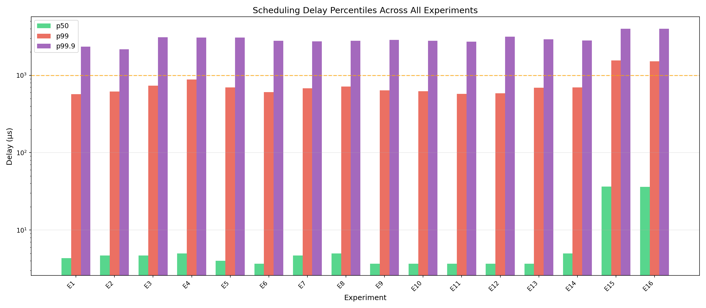
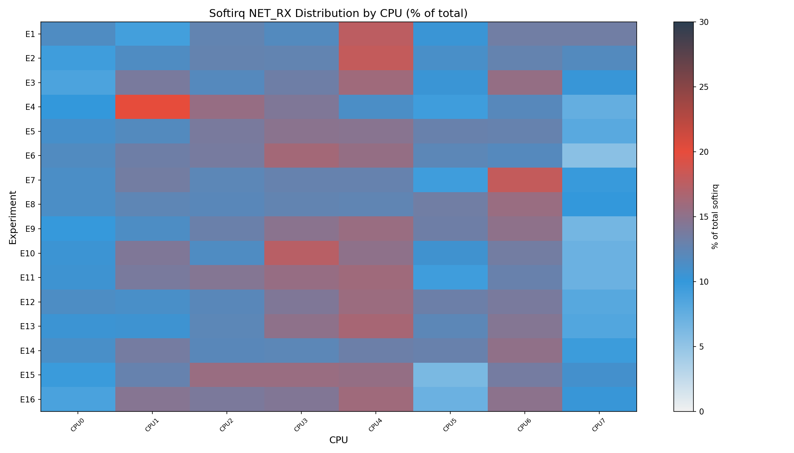
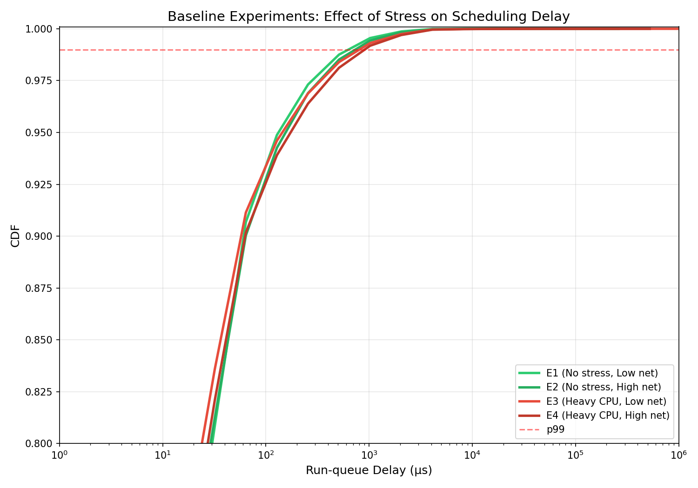
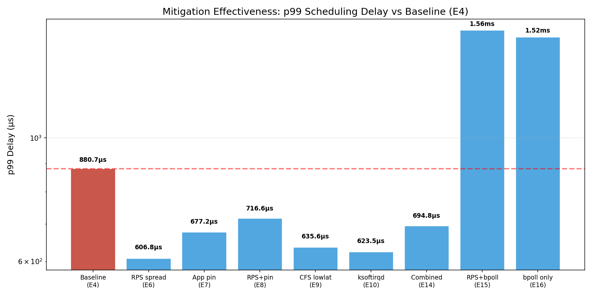
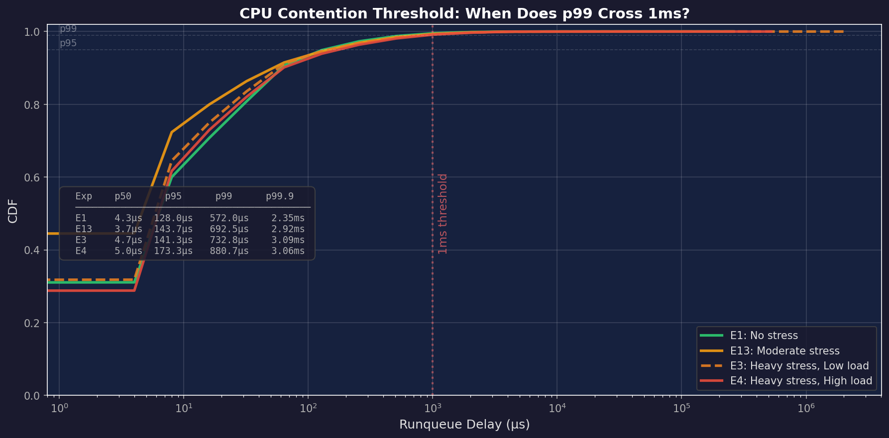
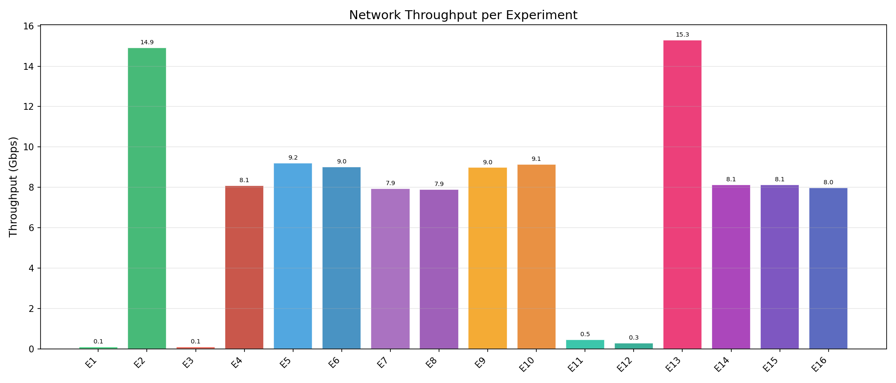

# Profiling Kernel Scheduling Delays Under Network-Intensive Workloads

> **An eBPF-Based Analysis and Mitigation Framework**

[](https://kernel.org)
[](https://github.com/bpftrace/bpftrace)
[](https://iiitd.ac.in)
[]()
[]()

On commodity Linux systems, the kernel's softirq processing path (`NET_RX_SOFTIRQ`, NAPI poll, TCP/IP stack) competes directly with user-space threads for CPU time. This project uses **eBPF** to instrument the Linux scheduler and network subsystems, quantifying these invisible scheduling delays through **16 controlled experiments** (48 total runs) on a single-machine testbed with network namespaces and veth pairs.

---

## 🔬 Key Findings

| # | Finding | Data |
|---|---------|------|
| 1 | **CPU contention increases p99 scheduling delay by 54%** | E1: 572μs → E4: 881μs under heavy stress |
| 2 | **RPS spread achieves the best p99 reduction (31%)** | E6: 607μs vs E4: 881μs baseline |
| 3 | **UDP and TCP show similar p99 under stress** | E12: 586μs vs E4: 881μs — CPU dominates protocol |
| 4 | **The stress cliff is non-linear** | E13 moderate: 693μs vs E4 heavy: 881μs |
| 5 | **`SO_BUSY_POLL` trades median for tail** | p50: 36μs (vs 5μs) but lowers softirq CPU% to 7.4% |
| 6 | **ksoftirqd reduces p99 by 29%** | E10: 624μs vs E4: 881μs |
| 7 | **Context switches reduced 16% with busy_poll** | E16: 29.0M vs E4: 34.7M context switches |

## 📊 Sample Results

<p align="center">
  
  
</p>
<p align="center">
  
  
</p>
<p align="center">
  
  
</p>

## 🏗 Architecture

```
┌──────────────────────────────────────────────────────────────┐
│                    Host Machine (8 cores)                     │
│                                                              │
│  ┌──────────┐     veth pair      ┌──────────┐               │
│  │  srv ns   │◄─────────────────►│  cli ns   │               │
│  │ 10.0.0.1  │  (88 Gbps veth)   │ 10.0.0.2  │               │
│  │ iperf3 -s │                   │ iperf3 -c │               │
│  └──────────┘                    └──────────┘               │
│                                                              │
│  ┌────────────────── eBPF Probes ──────────────────┐        │
│  │ sched_delay.bt  │ softirq_net.bt │ proc_pollers │        │
│  │ net_drops.bt    │ cpu_migrations │              │        │
│  └─────────────────────────────────────────────────┘        │
│                                                              │
│  stress-ng --cpu N  (optional CPU contention)                │
└──────────────────────────────────────────────────────────────┘
```

## 🧪 Experiment Matrix

16 experiments × 3 runs = **48 total runs**, each 60 seconds with 2s settle time.

| Exp | CPU Stress | Net Load | RPS | App Pin | CFS | Protocol | Purpose |
|-----|-----------|----------|-----|---------|-----|----------|---------|
| E1 | None | Low | Default | — | Default | TCP | Baseline |
| E2 | None | High | Default | — | Default | TCP | Net load effect |
| E3 | Heavy | Low | Default | — | Default | TCP | CPU stress effect |
| E4 | Heavy | High | Default | — | Default | TCP | **Worst case** |
| E5 | Heavy | High | CPU 0 | — | Default | TCP | RPS pinned |
| E6 | Heavy | High | All | — | Default | TCP | RPS spread |
| E7 | Heavy | High | Default | 2,3 | Default | TCP | App pinned |
| E8 | Heavy | High | CPU 0 | 2,3 | Default | TCP | RPS + pin |
| E9 | Heavy | High | Default | — | Lowlat | TCP | CFS tuning |
| E10 | Heavy | High | Default | — | Default | TCP | ksoftirqd |
| E11 | None | High | Default | — | Default | UDP | UDP baseline |
| E12 | Heavy | High | Default | — | Default | UDP | UDP + stress |
| E13 | Moderate | High | Default | — | Default | TCP | Threshold |
| E14 | Heavy | High | All | 2,3 | Lowlat | TCP | Combined mitigations |
| E15 | Heavy | High | All | — | Default | TCP | RPS + busy poll |
| E16 | Heavy | High | Default | — | Default | TCP | Busy poll only |

## 📈 Precise Results (from Sampled Events)

All percentiles computed from **~20,000 sampled scheduling delay events per run** (not histogram buckets).

| Exp | p50 (μs) | p90 (μs) | p95 (μs) | p99 (μs) | p99.9 (μs) | Mean (μs) | TP (Gbps) | SIrq CPU% |
|-----|---------|---------|---------|---------|-----------|----------|----------|----------|
| E1 | 4.3 | 58.0 | 128.0 | 572.0 | 2,347 | 36.8 | 0.1 | 16.6% |
| E2 | 4.7 | 66.7 | 150.2 | 615.8 | 2,170 | 38.4 | 14.9 | 20.4% |
| E3 | 4.7 | 55.3 | 141.3 | 732.8 | 3,090 | 54.5 | 0.1 | 8.7% |
| E4 | 5.0 | 65.3 | 173.3 | **880.7** | 3,060 | 50.4 | 8.1 | 10.1% |
| E5 | 4.0 | 34.3 | 99.0 | 695.2 | 3,060 | 38.0 | 9.2 | 8.9% |
| E6 | 3.7 | 28.0 | 78.2 | **606.8** | 2,790 | 30.9 | 9.0 | 9.0% |
| E7 | 4.7 | 38.7 | 111.9 | 677.2 | 2,740 | 37.3 | 7.9 | 8.4% |
| E8 | 5.0 | 46.0 | 147.0 | 716.6 | 2,790 | 41.1 | 7.9 | 8.4% |
| E9 | 3.7 | 31.7 | 98.0 | 635.6 | 2,860 | 35.1 | 9.0 | 8.8% |
| E10 | 3.7 | 30.7 | 91.8 | **623.5** | 2,800 | 33.9 | 9.1 | 8.8% |
| E11 | 3.7 | 42.7 | 117.3 | 576.4 | 2,710 | 33.8 | 0.5 | 24.4% |
| E12 | 3.7 | 29.3 | 83.7 | 586.1 | 3,160 | 34.9 | 0.3 | 12.7% |
| E13 | 3.7 | 48.7 | 143.7 | 692.5 | 2,920 | 38.6 | 15.3 | 15.8% |
| E14 | 5.0 | 45.0 | 135.3 | 694.8 | 2,810 | 41.2 | 8.1 | 8.6% |
| E15 | 36.3 | 242.4 | 425.2 | 1,561 | 4,004 | 121.0 | 8.1 | 7.4% |
| E16 | 36.0 | 237.7 | 424.7 | 1,518 | 3,984 | 119.9 | 8.0 | 7.5% |

## 📁 Repository Structure

```
├── scripts/                           # Experiment orchestration
│   ├── 24_setup_testbed.sh              # Create/teardown network namespaces + veth
│   ├── 24_run_experiment.sh             # Run a single experiment (10 CLI params)
│   ├── 24_run_all_experiments.sh        # Orchestrator: runs all 4 phases (or one)
│   ├── 24_phase1_baselines.sh           # Phase 1: Baseline experiments (E1–E4)
│   ├── 24_phase2_placement.sh           # Phase 2: Softirq placement & pinning (E5–E8)
│   ├── 24_phase3_advanced.sh            # Phase 3: CFS, softirq, UDP (E9–E13)
│   ├── 24_phase4_mitigations.sh         # Phase 4: Mitigation strategies (E14–E16)
│   ├── 24_cross_validate_data.sh        # 420-check data integrity validation
│   └── 24_extract_metrics.py            # Extract precise metrics → hardcoded data
│
├── ebpf_tools/                        # eBPF instrumentation (5 scripts)
│   ├── 24_sched_delay.bt                # sched_wakeup → sched_switch runqueue delay
│   ├── 24_softirq_net.bt               # NET_RX/TX softirq per-CPU duration
│   ├── 24_net_drops.bt                  # kfree_skb drops + tcp_retransmit_skb
│   ├── 24_cpu_migrations.bt            # sched_migrate_task tracking
│   ├── 24_proc_pollers.sh              # /proc/stat, softnet_stat, snmp, sockstat
│   └── 24_busy_poll_echo_server.c      # Custom SO_BUSY_POLL echo server (E15/E16)
│
├── analysis/                          # Analysis & visualization
│   ├── 24_hardcoded_data.py             # Pre-extracted metrics (instant plots)
│   ├── 24_generate_plots_hardcoded.py   # 21 plots from hardcoded data (recommended)
│   ├── 24_generate_plots.py             # 15+ plots from raw data (slow)
│   ├── 24_parse_histograms.py           # Shared: histogram parser + CDF generator
│   ├── 24_timeseries_plots.py           # Time-series 3-axis plots
│   ├── 24_validate_h1.py               # H1: Softirq colocation hypothesis
│   ├── 24_validate_h2_h3.py            # H2: ksoftirqd + H3: TCP vs UDP
│   └── 24_validate_h4.py               # H4: Combined mitigations
│
├── data/                              # Raw experiment data (960 files, ~64 MB)
│   └── E{1..16}/run_{1..3}/             # 21 files per run:
│       ├── metadata.json                  # Experiment config + system info
│       ├── sched_delay.csv                # ~20K sampled scheduling delay events
│       ├── sched_delay_summary.txt        # bpftrace histogram + percentile summary
│       ├── softirq_net_summary.txt        # Per-CPU softirq distribution
│       ├── cpu_util.csv                   # Per-second CPU utilization breakdown
│       ├── iperf3_result.json             # Network throughput results
│       ├── tcp_stats.csv                  # TCP retransmit counters
│       ├── softnet_stat.csv               # Softnet drops & time_squeeze
│       ├── cpu_migrations_summary.txt     # Task CPU migration counts
│       └── ...                            # interrupts, sockstat, net_drops, etc.
│
├── plots/                             # Generated plots (46 PNGs + CSV)
│   ├── 24_runqueue_delay_cdf_all.png    # All 16 experiments CDF overlay
│   ├── 24_percentile_comparison.png     # p50/p99/p99.9 bar chart
│   ├── 24_mitigation_p99_comparison.png # Mitigation effectiveness
│   ├── 24_contention_threshold.png      # Stress progression with 1ms line
│   ├── 24_throughput_comparison.png     # Network throughput per experiment
│   ├── 24_experiment_metrics.csv        # Complete metrics in CSV format
│   └── ...                              # 40+ additional plots
│
└── README.md                          # This file
```

## 🚀 Quick Start

### Prerequisites

```bash
sudo apt update && sudo apt install -y \
    bpftrace bpfcc-tools linux-tools-$(uname -r) \
    iperf3 stress-ng memcached libmemcached-tools \
    python3-matplotlib python3-numpy
```

| Component | Minimum Version |
|-----------|----------------|
| Ubuntu | 22.04 LTS |
| Kernel | ≥ 5.15 with BTF (`CONFIG_DEBUG_INFO_BTF=y`) |
| bpftrace | ≥ 0.17.0 |
| iperf3 | ≥ 3.9 |
| stress-ng | ≥ 0.13 |
| memcached | ≥ 1.6 |
| memcslap | libmemcached-tools ≥ 1.1 |
| Python 3 | ≥ 3.9 (matplotlib, numpy) |
| CPU cores | ≥ 4 (8 recommended) |

### Run Experiments

```bash
# 1. Set up testbed (network namespaces + veth pair)
sudo scripts/24_setup_testbed.sh setup

# 2a. Run all 16 experiments at once (3 runs each, ~4 hours)
sudo scripts/24_run_all_experiments.sh

# 2b. Or run individual phases:
sudo scripts/24_phase1_baselines.sh    --duration 60 --runs 3   # E1–E4
sudo scripts/24_phase2_placement.sh    --duration 60 --runs 3   # E5–E8
sudo scripts/24_phase3_advanced.sh     --duration 60 --runs 3   # E9–E13
sudo scripts/24_phase4_mitigations.sh  --duration 60 --runs 3   # E14–E16

# 2c. Or use the orchestrator with --phase flag:
sudo scripts/24_run_all_experiments.sh --phase baselines
sudo scripts/24_run_all_experiments.sh --phase placement
sudo scripts/24_run_all_experiments.sh --phase advanced
sudo scripts/24_run_all_experiments.sh --phase mitigations

# 3. Validate data integrity (420 checks)
bash scripts/24_cross_validate_data.sh

# 4. Extract precise metrics from raw data
python3 scripts/24_extract_metrics.py > analysis/24_hardcoded_data.py

# 5. Generate all 21 plots (instant, from hardcoded data)
python3 analysis/24_generate_plots_hardcoded.py

# 6. Validate hypotheses
python3 analysis/24_validate_h1.py
python3 analysis/24_validate_h2_h3.py
python3 analysis/24_validate_h4.py
```

### Teardown

```bash
sudo scripts/24_setup_testbed.sh teardown
```

## 🧩 Hypothesis Results

| Hypothesis | Description | Result |
|-----------|-------------|--------|
| **H1** | Softirq colocation increases p99 delay | **Partially supported** — RPS spread (E6) reduces p99 by 31%: 881μs → 607μs, Gini 0.10→0.07 |
| **H2** | ksoftirqd threading reduces tail latency | **Supported** — E10 reduces p99 by 29%: 881μs → 624μs |
| **H3** | UDP shows lower per-packet scheduling delay | **Partially supported** — E12 p99: 586μs vs E4: 881μs (33% lower) |
| **H4** | Combined mitigations reduce p99 by ≥20% | **Mixed** — E14 p99: 695μs (21% improvement), but busy_poll increases median 7× |

## 🏆 Best Configurations by Goal

| Goal | Best Experiment | Key Metric |
|------|----------------|------------|
| Highest throughput | E13 (moderate stress, high net) | 15.3 Gbps |
| Best throughput under heavy stress | E5 (RPS→CPU0) | 9.2 Gbps |
| Lowest p99 scheduling delay | E1 (no stress) | 572μs |
| Lowest p99 under stress | E6 (RPS spread) | 607μs (31% better than E4) |
| Lowest mean delay under stress | E6 (RPS spread) | 30.9μs mean |
| Fewest context switches | E15/E16 (busy poll) | 29.0M |
| Lowest softirq CPU overhead | E15 (RPS + busy poll) | 7.4% |

## ⚠️ Known Limitations

- **veth vs physical NIC**: veth bypasses hardware IRQ paths; RPS behavior differs from physical NICs
- **Single-machine testbed**: Network namespaces share the same kernel, so scheduling contention is more pronounced
- **Sample size n=3**: Limited statistical power per experiment (but 48 total runs)
- **`SO_BUSY_POLL` trade-off**: Reduces context switches and softirq CPU% but increases median delay 7× (4μs → 36μs) due to polling overhead

## 👥 Team

| Name | ID |
|------|-----|
| Rohit Kumar | MT25037 |
| Arpit Kumar | MT25017 |
| Abhinay Prakash | MT25010 |
| Nindra Dhanush | MT25074 |
| Adarsh Shukla | PhD25001 |

**Institution:** IIIT-Delhi  
**Course:** CSE638 — Graduate Systems (GRS)  
**Date:** April 2026

## 📄 License

Academic project — all rights reserved by the authors.
